What Is It?
-----------

[TeamStack](http://www.teamstack.cn/)是一款实时日志查看监控客户端工具。 用于快速高效的查看和监控本地或远程的日志文件。 
类似命令"tail"，在本地展示并跟踪日志信息。 
通过过滤器，搜索，高亮等辅助等功能，快定位异常，让你更专注于程序开发与运行。

	<a href="http://www.teamstack.cn">Download</a> ·
	<a href="https://djmpink.github.io/log-dashboard/">Documentation</a>

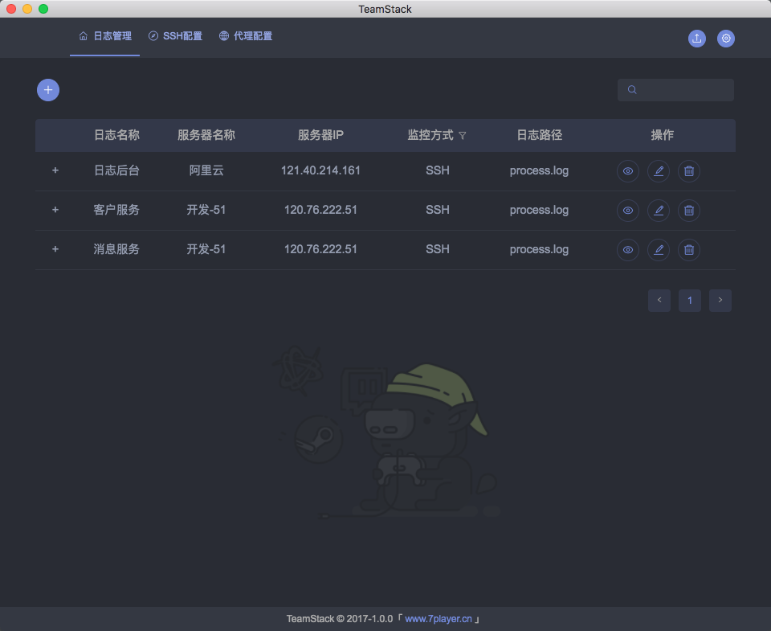

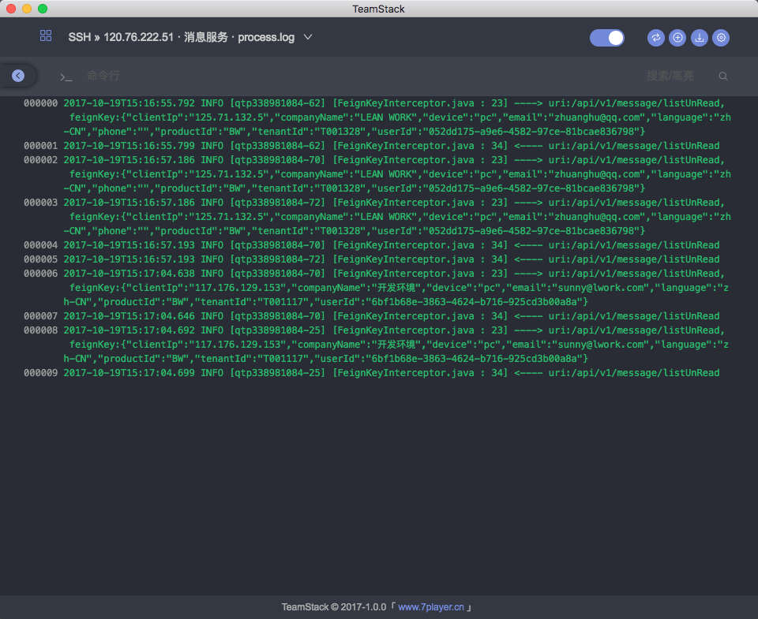

## 简介
开发工作总是需要和日志打交道。而在开发，调试，监控时最常使用的命令是“tail -f xxx.log”来实时了解日志信息。但每次查看日志总是需要打开命令行工具，登录服务器，找到日志文件。
另外，在分布式，微服务的潮流下导致日志数量增多，分散。如果考虑到不同的环境（如开发，测试，生产等）又将成倍增加。
因此，TeamStack希望TeamStack通过在线服务，存储配置信息，将日志信息有效集中化管理。简化操作过程，做到随时快速看到日志流动信息，提高工作效率和质量。

## 工作方式
TeamStack通过远程连接至日志所在服务器，根据所配置的日志文件信息获取日志实时内容并将其输出到客户端。
TeamStack目前主要提供两种远程连接方式：SSH方式和代理方式。
1.SSH方式
客户端根据配置的ssh信息通过ssh协议直接登录服务器。
该方式配置简单，使用方便。并且因为是直接访问，执行效果较好。
但缺点是需要使用服务器用户名和密码，有些环境可能无法提供或了解该信息。
2.代理方式
通过部署代理程序，实现标准接口，由代理程序访问日志信息，然后再通过WebSock方式实时输出到客户端。
该方式存在转发过程，中间可能经过两次网络传输，速度可能不及ssh方式。另外还需要配置部署代理程序，存在使用门槛。
有点是代理程序可自定义，可拓展，比如可以对日志进行聚合，存储等操作。屏蔽服务器账户信息，对接更多场景。

代理程序接口与实现文档参考【】。
文档提供不同语言的示例程序，可根据需求直接使用或拓展。

## 使用帮助

### 用户
1.登录

支持：邮箱登录，三方登录（QQ，github）

2.注册

填写注册邮箱-->点击“注册”-->发送注册验证邮件-->进入邮箱点击“验证链接”-->验证成功-->登录

3.找回/修改密码

忘记密码-->填写注册邮件-->发送找回密码邮件-->进入邮箱点击“重置密码”-->设置新密码-->重新登录

用户设置页-->修改密码-->填写旧密码与新密码-->点击“重置密码”-->发送重置密码邮件-->进入邮箱点击“重置密码”-->重新登录

4.绑定/修改邮箱

用户设置页-->修改邮箱-->填写邮箱-->点击“设置”-->发送绑定邮件-->进入邮箱点击“绑定邮箱”

5.修改昵称

用户设置页-->修改昵称

### 配置
1.配置管理

（1）日志配置列表

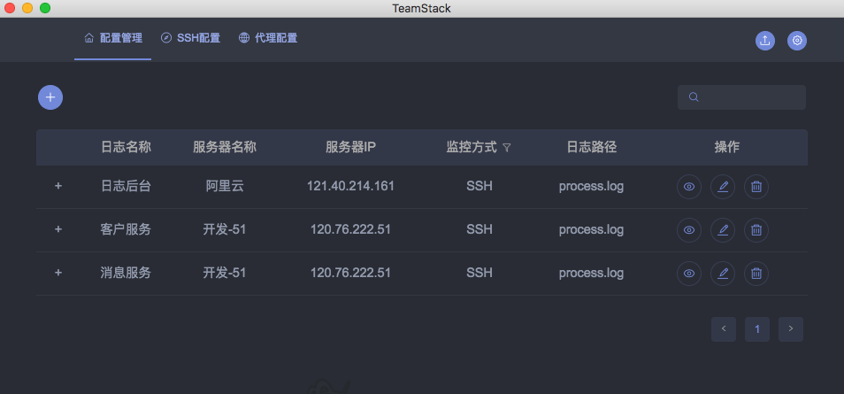

（2）SSH配置列表

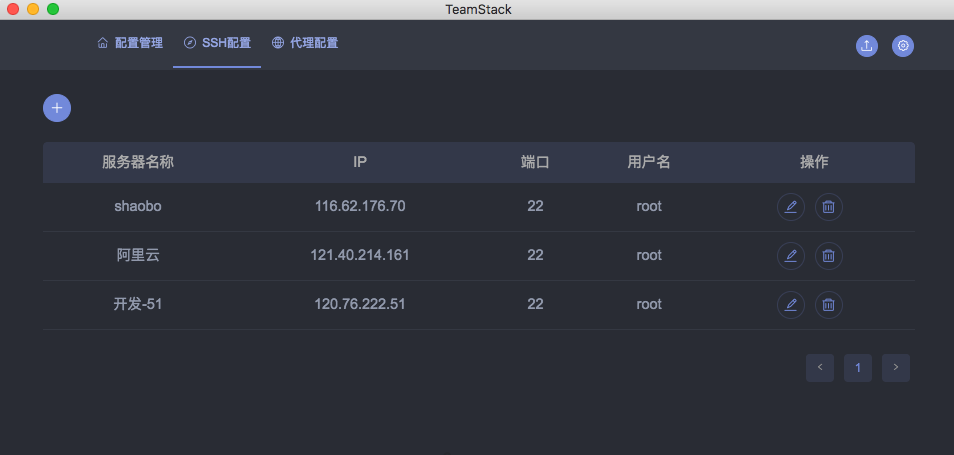

（3）代理配置

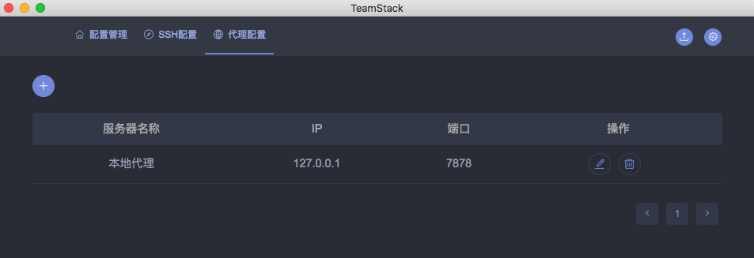

3.配置SSH

（1）切换为“SSH配置”标签页，点击“+”新增SSH配置

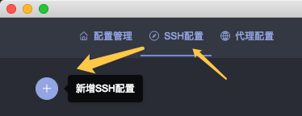

（2）编辑ssh账户信息

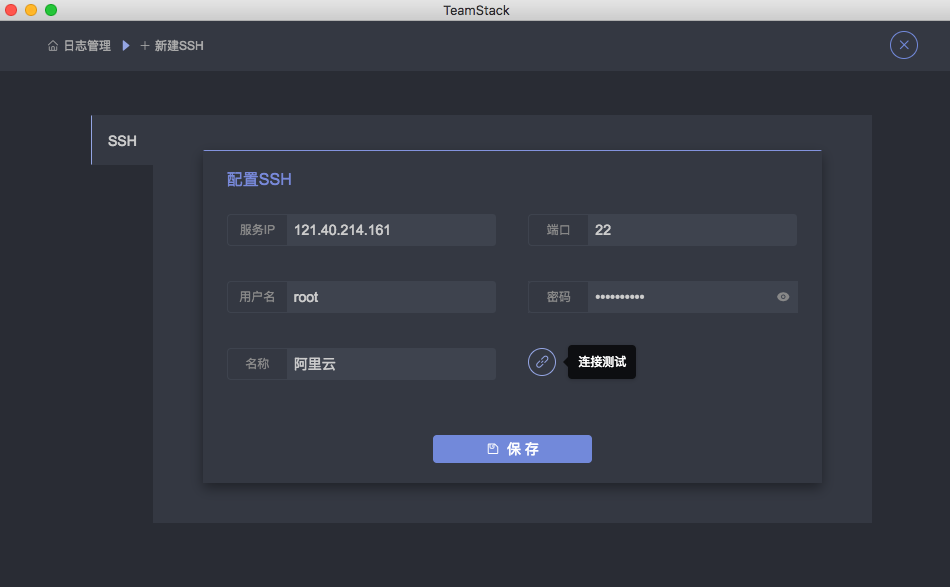

（3）测试连接状态

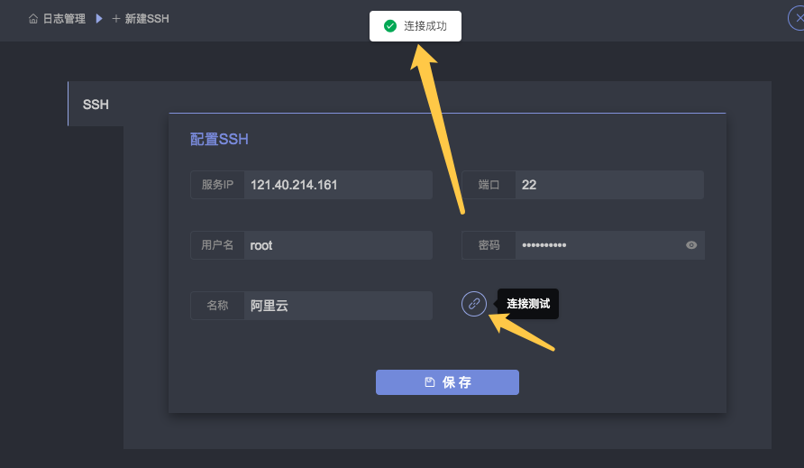

（4）点击保存

4.配置代理

（1）切换为“代理配置”标签页，点击“+”新增代理配置

（2）配置代理程序信息

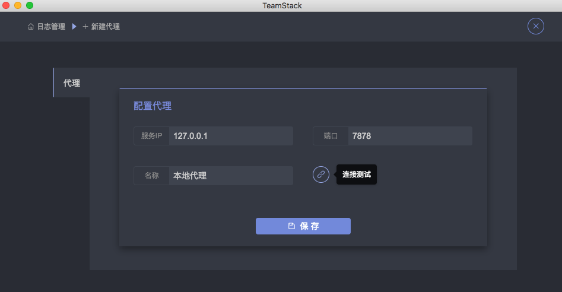

（3）点击“测试连接”，测试访问状态

（4）点击“保存”

4.配置日志文件

（1）切换为“日志管理”标签页，点击“+”新增代理配置

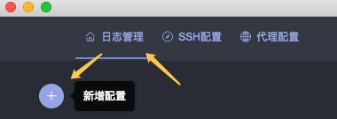

（2）左侧切换配置方式（SSH/代理/文件）以配置SSH为例：

在下拉列表中选对应服务器ssh配置
配置日志信息，如日志名称，日志文件路径等。

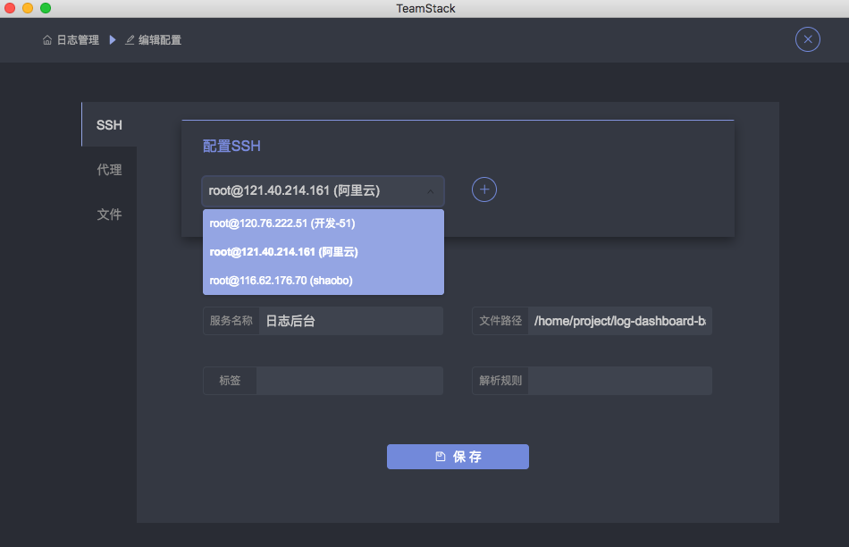

（3）点击保存

### 实时日志
1.查看实时日志

（1）点击列表中“查看”，或者“双击”该行，进入日志显示页。

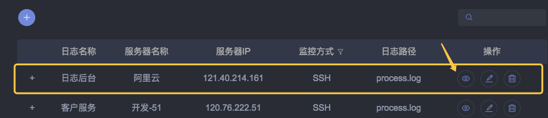

（2）进入为“关闭”状态，点击右上方“开关切换”按钮开启日志显示：

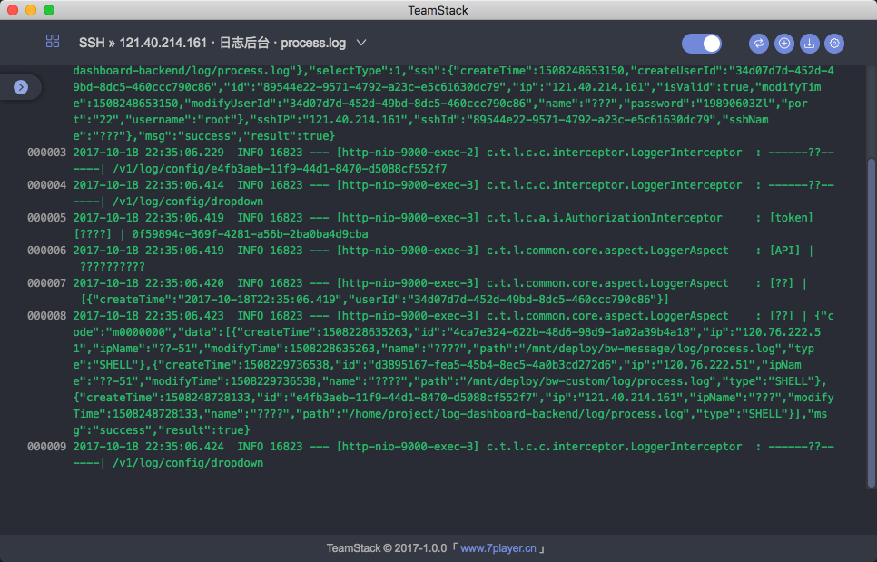

2.辅助功能
* 快速切换日志

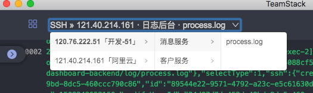

* 关键词搜索/关键词高亮

输入关键词，日志信息中将自动高亮该内容。键盘回车将执行全文关键词搜索功能，类似执行“ grep 'keyworks' xxx.log ”

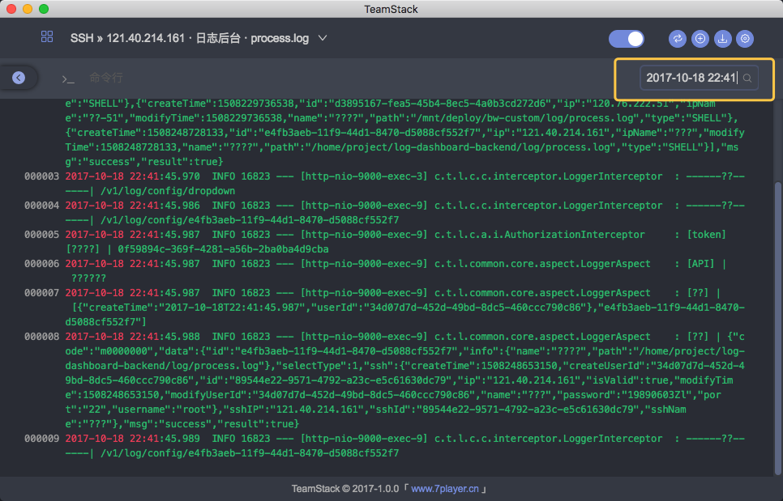

* 命令行

功能运行输入linux命令行命令，并将在其对应的日志目录下执行该命令。可根据需要灵活使用。

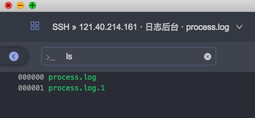

* 清空屏幕

该功能将清空当前屏幕信息。

